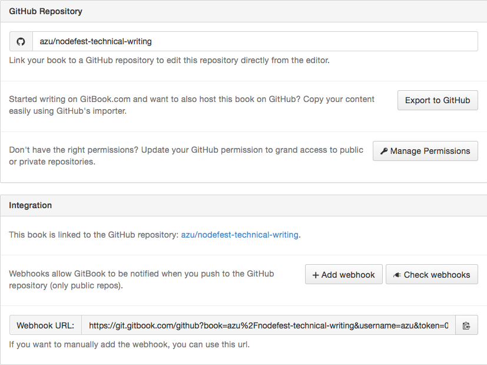

# 技術文書をソフトウェア開発する話

技術文書の自動テスト、開発プロセスについて

----

# 自己紹介


- Name : **azu**
- Twitter : @[azu_re](https://twitter.com/azu_re)
- Website: [Web scratch], [JSer.info]

[Web scratch]: http://efcl.info/ "Web scratch"
[JSer.info]: http://jser.info/ "JSer.info"

----

# 目的

- 技術文書を書くのはもっと身近ものとなっている事を知る
- ブログの延長線上としてのステップ
- 技術文書をテストする

----

# Why techinical writing?

- 文章だと小説とかも含まれてるのでやり方が異なりそう
- 技術文書だとセマンティックがはっきりしてるのでとりかかりやすい
    - 「技術書の英語は読みやすい」とかそういうのに近い
- なのでまずは身近な技術文書からやりましょう

----

# アジェンダ

- 技術書を書くモチベーション
    - ブログは書くけど技術書みたいな長いものは書けない
    - 途中で放置された文章
    - 完成が見えずに放置されたソフトウェア
    - とりあえず動くようにして進めていく
    - リアクションが欲しい
    - CIにリアクションして怒られるようにする
- 3クリックで電子書籍を書き始める
- 技術文書のサンプルコードのテスト
- textlintについて
- プロジェクトごとに表記揺れのルールを設ける必要性
- 文章に対するCI
- 決してバグ(typo)は無くならない

-----

# 今日扱う「技術文書」の対象

- 技術文書
    - [x] 技術書
    - [x] ブログ
    - [x] スライド
    - [ ] マニュアル
    - [ ] 論文
    
---- 

# 技術書

どのようなツールを使って技術書を開発できるか

## [JavaScript Plugin Architecture](https://github.com/azu/JavaScript-Plugin-Architecture "JavaScript Plugin Architecture")

----

## [JavaScript Plugin Architecture](https://github.com/azu/JavaScript-Plugin-Architecture "JavaScript Plugin Architecture")

- JavaScriptプラグインアーキテクチャについての技術書
- 1章1ライブラリというシンプルな構成
    - jQuery、ESLint、Connect、gulpなどそれぞれが1つの章
- 更新が継続しやすい形を目指した

----

## 技術書に必要な要素(Q)

- MarkdownからHTML/PDF/Epubへの変換
- ファイルのincludeするMarkdown拡張
- サンプルコードのチェック
- Markdown/文章のチェック
- 使いやすいエディタ

----

## 技術書に必要な要素(A)

- **[GitBook](https://www.gitbook.com/)** - MarkdownからHTML/PDF/Epubへの変換
- **[GitBook](https://www.gitbook.com/)** - ファイルのincludeするMarkdown拡張
- **[ESLint](http://eslint.org/)** - サンプルコードのチェック
- **[textlint](https://github.com/azu/textlint "textlint")** - Markdown/文章のチェック
- **好きなMarkdownエディタ** - 使いやすいエディタ

----

# [GitBook](https://www.gitbook.com/)


----

## What is [GitBook](https://www.gitbook.com/)

- Markdown/AsciiDocで電子書籍を書けるツール/プラットフォーム
- [GitbookIO/gitbook](https://github.com/GitbookIO/gitbook "GitbookIO/gitbook")
    - MarkdownからHTML/PDF/Epub/mobiへの変換
    - 各章を書いて`SUMMARY.md`にリンクを書くだけできる
    - プラグインで拡張が可能
- GitHub Pagesでも公開は簡単

-----

## [gitbook.com](https://www.gitbook.com)

- GitBookの公開プラットフォーム
- HTML/PDF/Epubの自動生成、コミット毎プレビュー、販売/寄付、Organization、アップデート通知、オンラインエディタ
- GitHubとDeployment APIでhookして自動的に反映できる
    - Pull Requestのコミット毎にプレビューできる
    
-----

## GitBookの構造


```
├── README.md
├── Chapters(各章)
│   ├── jquery.md
│   └── ESLint.md
├── SUMMARY.md
└── book.json
```

- `SUMMARY.md` は目次ファイル
- `book.json` はGitBookのメタファイル

-----

## SUMMARY.md

- `SUMMARY.md`には各章へのリンクを貼る
- `SUMMARY.md`は目次ファイル

```
- [jQuery](chapters/jquery.md)
- [ESLint](chapters/ESLint.md)
...
```

----

## GitBookの表示確認

最低限`SUMMARY.md`があればビルドできる

```
npm install -g gitbook-cli
gitbook serve
# open http://localhost:4000
gitbook build
# _books/にHTMLが吐き出される
gitbook pdf|epub|mobi
# pdf epub mobiの出力
```

---

## gitbook.comとの連携



----

## Pull Requestでのレビュー


Pull Requestのコミット毎にプレビューが行える

----

## gitbook.comとの連携機能

- コミット毎にプレビューできる！
    - Pull Requestに対してもプレビューが生成される
    - すぐ確認できるのでレビューにとても便利
    - ローカルに開発環境を持ってなくても編集ができる
- 自動でHTML/PDF/epub/mobiが生成される
- gitbook.com上で書籍を公開できる(自動デプロイ)

----

## GitBookまとめ

- Markdown/AsciiDocで文章を書ける
- `SUMMARY.md`に目次を書く
- `gitbook build`で電子書籍が出来上がる
- 必要なものがnpm一発で手に入る
- シンプルな構造なので拡張しやすい

----

# 技術書を書く環境はできたが…

- 技術書は一日で終わらない
    - ブログよりサイズが大きい
- 途中で飽きてしまう問題
- 継続的に書いていくにはどうするか？

-----

# ソフトウェア開発で継続的に開発する場合

- Lintを使ってコードをチェックする
- テストを書いてCIを回す
- Issue/Pull Requestで少しづつ実装する
    - コードレビューを行う
- 文章においても同じことができれば継続的に書けるのでは？

モチベーションが最も大事ではあるけど、自然言語とプログラミング言語で環境的な差がある
    
-----

# 文章は動的型付け言語

- 自然言語は動的型付け言語
    - コンパイルエラーじゃなくてランタイムエラー
- コンテキストによって意味解釈が変わる
- 規則性はあるが例外も多い
    
----

## 自然言語とプログラミング言語

> 自然言語の意味は、その文脈（コンテキスト）によって定まる部分も多い。
> これに対して、プログラミング言語は、コンピュータによって扱いやすいように、文脈によって意味が変わることができるだけないように設計されている。
> -- [プログラミング言語 - Wikipedia](https://ja.wikipedia.org/wiki/%E3%83%97%E3%83%AD%E3%82%B0%E3%83%A9%E3%83%9F%E3%83%B3%E3%82%B0%E8%A8%80%E8%AA%9E "プログラミング言語 - Wikipedia")

----

## 自然言語もLintしたい

- ランタイムエラー(誤字や脱字)を減らすためにLintをする
    - いわゆる校正をするツール
- 自然言語のデファクトルールに沿ってるかをチェックする？
    - 自然言語のデファクトルールに絶対的なものはない！
    
------

## 自然言語は変化する

> 自然言語は、誤用や流行などにより長い時間をかけ、たくさんの人間の利用により、意図せざる形で変化していく。
> しかし、プログラミング言語の規則は、言語設計者の意図と作業によってのみ、変更される。
> -- [プログラミング言語 - Wikipedia](https://ja.wikipedia.org/wiki/%E3%83%97%E3%83%AD%E3%82%B0%E3%83%A9%E3%83%9F%E3%83%B3%E3%82%B0%E8%A8%80%E8%AA%9E "プログラミング言語 - Wikipedia")


------

## 自然言語のLintは拡張可能

- 自然言語にスタンダードなルールはない
    - JSHintのように1つの固まりとして提供するのは難しい
- ルールはPlugableに拡張できないといけない
    - ESLintのようにルール毎に実装が分かれている必要がある
    - 利用者がどのルールを使うかを決める事ができる
    - 利用者がルールを自由に追加できる
- そのために[textlint](https://github.com/azu/textlint "textlint")を作った

-----

# [textlint](https://github.com/azu/textlint "textlint")

- Markdownなどのテキストファイルを扱うLintツール
- デフォルトのルールはない
- ESLintと同じくPlugableにルールを追加することができる
- JavaScriptでルールを簡単に書くことができる

-----

## ルールの紹介

[textlint](https://github.com/azu/textlint "textlint")のルール紹介


----

## ですます調とである調の統一

- [textlint-rule-no-mix-dearu-desumasu](https://github.com/azu/textlint-rule-no-mix-dearu-desumasu)
    - 文中の敬体(ですます調)と常体(である調)をどちらかに統一する
    - 元ネタは[RedPen](http://redpen.cc/ "RedPen")

----

## 技術書は一朝一夕で作れない

- 技術書の場合一日で書き終わらない
- 日によって敬体(ですます調)だったり、常体(である調)だったりする
    - 昨日は敬体で、今日は常体だったり…
- 敬体(ですます調)と常体(である調)の統一を自動的にチェックする

-----

## textlintのルール

- [textlint-rule-max-ten](https://github.com/azu/textlint-rule-max-ten)
    - 一文に利用できる`、`の数をチェックするルール
- [textlint-rule-spellcheck-tech-word](https://github.com/azu/textlint-rule-spellcheck-tech-word)
    - WEB+DB用語統一ルールベースの単語チェックするルール
- [textlint-rule-no-start-duplicated-conjunction](https://github.com/azu/textlint-rule-no-start-duplicated-conjunction "azu/textlint-rule-no-start-duplicated-conjunction")
    - _「しかし、〜。 しかし、〜。」_ など同じ接続詞が連続してないかをチェックするルール
- textlintのルールは以下にまとめられている
    - [Collection of textlint rule · azu/textlint Wiki](https://github.com/azu/textlint/wiki/Collection-of-textlint-rule "Collection of textlint rule · azu/textlint Wiki")

----

## JTFスタイルガイド


- [textlint-plugin-JTF-style](https://github.com/azu/textlint-plugin-JTF-style "textlint-plugin-JTF-style")
- [JTF日本語標準スタイルガイド（翻訳用）](https://www.jtf.jp/jp/style_guide/styleguide_top.html "JTF日本語標準スタイルガイド（翻訳用）")でチェックできるtextlintルールセット
    - 40種類ぐらいのルールでチェックできる
    - もちろん個別に無効化できる
- 技術文書は元々英語圏の技術についてが多いのでマッチするツールも多い

-----

# 表記揺れ

> にげんん は ひうょきゆれ への たせいい を ものつで しよんう でなきい

人間は表記揺れへの耐性を持つので信用出来ない

-----

## 人間は表記揺れを吸収できる

> こんちには みさなん おんげき ですか？　わしたは げんき です。

- [「読めてしまう」文章ネタの起源と歴史［絵文録ことのは］2009/05/10](http://www.kotono8.com/2009/05/10yometeshimau.html "「読めてしまう」文章ネタの起源と歴史［絵文録ことのは］2009/05/10")

-----

### クローズドテスト


- 逆に穴あきでも読めることでリーダービリティをテストする手法もある

> 一定間隔で穴が開いた状態のテキストを読んで、ユーザーが文章の意味をくみ取れるかをチェックする為のテスト

- [JavaScript - kuromoji.jsを使って日本語クローズテスト - Qiita](http://qiita.com/pppp403/items/59d90a4483ba86826e63 "JavaScript - kuromoji.jsを使って日本語クローズテスト - Qiita")


------

## 表記揺れは機械的にチェック

- 目視の確認では表記揺れは思ってる以上に見つけにくい
- IMEが間違った単語を記憶することで繰り返し発生する
- 一度間違ったものを辞書に加えて継続的にチェックする必要
    - リグレッションテストが重要

------

## プロジェクト固有の表記揺れ

- 表記揺れのチェックに汎用的な辞書/ルールはない
    - 全ての表現が一意ならそもそも表記揺れなんて起きない
    - 技術文書の中で一貫した表現を保証するためのもの
- プロジェクト固有のルールで表記揺れのチェックが必要

-----

## [textlint-rule-prh](https://github.com/azu/textlint-rule-prh "textlint-rule-prh")


- [vvakame/prh](https://github.com/vvakame/prh "vvakame/prh") を使ったtextlintルール
- ymlでルールを簡単に追加できる(正規表現や大文字小文字などよくある表記揺れは簡単に書ける仕組みがある)

```
rules:
  - expected: タスク自動化ツール
    patterns:
      - /Task Runner/i
      - タスクランナー
      - タスク管理ツール
```

-----

## なぜプロジェクト毎に表記揺れルール？

- 表記揺れを見つけた時にルールを追加して**から**修正
    - [connet => **C**onnectに統一 · Issue #48 · azu/JavaScript-Plugin-Architecture](https://github.com/azu/JavaScript-Plugin-Architecture/issues/48 "**C**onnectに統一しよう · Issue #48 · azu/JavaScript-Plugin-Architecture")
    - リグレッションテストと同じ意味合い
- 表記がルールとして明文化できるので[Contribute](https://github.com/azu/JavaScript-Plugin-Architecture/blob/master/CONTRIBUTING.md "Contribute")しやすい

-----

## GitBook + textlint

- GitBookは`SUMMARY.md`から各章のMarkdownファイルへのリンクがある
- [azu/gitbook-summary-to-path](https://github.com/azu/gitbook-summary-to-path "azu/gitbook-summary-to-path")
- SUMMARY.mdに書かれているファイルを`textlint`する

```sh
$ summary-to-path SUMMARY.md | xargs textlint
# 全ての章がtextlintでLintできる
```

-----

# Atom + [linter-textlint](https://github.com/1000ch/linter-textlint "1000ch/linter-textlint")

> [textlintのAtomプラグイン - 1000ch.net](https://1000ch.net/posts/2015/linter-textlint.html "textlintのAtomプラグイン - 1000ch.net")


リアルタイムにチェックできて便利

-----

# textlintの仕組み

1. Markdown or TextをASTに変換
2. ASTは**TxtNode**というインタフェースを持つ
    - 例えば、`node.type`が"Header"という種類
    - `node.raw`にテキストの中身、`node.loc`に行番号等の位置

-----

## Markdown -> AST


-----

## AST


-----


## textlintのルールの仕組み

- ルールスクリプトは`node.type`ごとにイベントを受け取るような書き方をする

```js
export default function(context){
  let {Synxtax, report} = context;
  return {
    [Syntax.Link] = function (node) {
      // Link nodeの時にこのチェック関数が呼ばれる
      // 問題があったらcontext.report()で報告する
    }
  };
}
```

-----

## 仕組みの仕組み

- textlintとルールスクリプトの関係はpub/sub
- ルールスクリプトはやってくるnodeだけを考えればLintを書ける
- やってくるnodeの流れは木構造を走査する形 [txt-ast-traverse](https://github.com/azu/txt-ast-traverse "txt-ast-traverse")
- ルールが疎結合なので、自由にルールを追加できる！

-----

## 木構造のTraverse

[](http://azu.github.io/markdown-to-ast/example/)
=> 
[](http://azu.github.io/visualize-txt-traverse/)

----


## エラーの通知


- `context.report()`で報告されたエラーをフォーマッターで整形して出力


-----

## texlint まとめ

- 人間やIMEは表記揺れを吸収してしまう
    - ランタイムエラーが発生しやすい
- 静的にtextlintで文章をチェックする
    - ランタイムエラーになる前に問題を見つける
- チェックルールは自由に拡張できないといけない
    - 自然言語は柔軟なのでプロジェクト毎にルールが異なる
    
----

# サンプルコードのテスト


----

## サンプルコードの種類

- 技術書に載せるコードを書く方法は2種類
- 外部ファイルとしてコードを書いて読み込む
- 文中にインラインでコードを書く

-----

## 外部ファイルとしてコードを書いて読み込む

- 普通に`.js`などのファイルとして書くだけ
- ファイルに対して[ESLint](http://eslint.org/ "ESLint")でLint
- コードに対してテストを書く
- 要は普通のJavaScript

----

## GitBookと外部ファイル

- [azu/gitbook-plugin-include-codeblock](https://github.com/azu/gitbook-plugin-include-codeblock "azu/gitbook-plugin-include-codeblock")
- いい感じに外部ファイルを`CodeBlock`として読み込むGitBookプラグイン

```
[include, test.js](example/test.js)
```

`include`というコマンドがラベルにあれば展開される。
=> GitHub上ではただのリンクとなる(Fallback)

----

## インラインコードのLint

    これは`a`という変数を定義している。
    ```js
    var a = 1;
    ```

- インラインに書かれているコードに対してもLintを行う
- インラインコードは実行されないのでtypoし易い

----

## インラインコードのLint

- [eslint/eslint-plugin-markdown](https://github.com/eslint/eslint-plugin-markdown "eslint/eslint-plugin-markdown")を利用
- ESLintのプラグインとしてインラインコードをLintできる
    - `js`や`javascript`といったCodeBlockに対してLint


----

## インラインコードのLint問題

- インラインコードは実行**できない**のが正常という問題
- 説明するためにコードの一部を取りだす場合
    - コードとしては実行できない
    - コードブロックのみで見ると変数が未定義となってる
- => インラインコード専用のゆるいルールを作る

----

## インラインコード専用のゆるいルール

- 設定ファイルを分けることで解決！
- 通常のコード用: [.eslintrc](https://github.com/azu/JavaScript-Plugin-Architecture/blob/master/.eslintrc ".eslintrc")
- インラインコード用: [.md.eslintrc](https://github.com/azu/JavaScript-Plugin-Architecture/blob/master/.md.eslintrc ".md.eslintrc")
    - `.eslintrc`を継承
    - `no-undef`や`no-unused-vars`などを無効化
