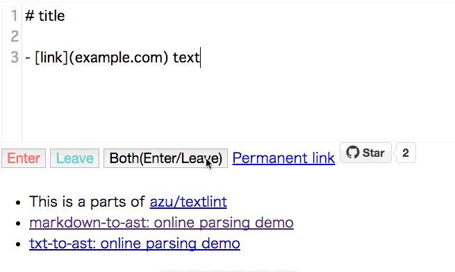
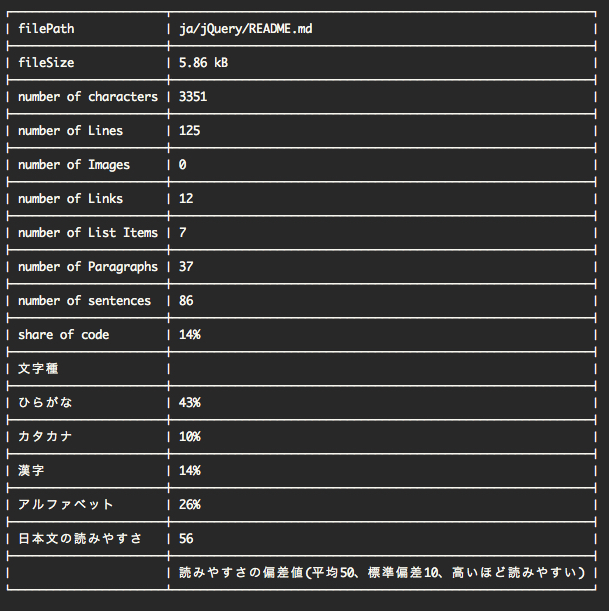

# 自己紹介


- Name : **azu**
- Twitter : @[azu_re](https://twitter.com/azu_re)
- Website: [Web scratch], [JSer.info]

[Web scratch]: http://efcl.info/ "Web scratch"
[JSer.info]: http://jser.info/ "JSer.info"

----

# 目的

- 技術文書を書くのは身近ものとなっている事を知る
- ブログ以上、技術書以下の文書を書くための構造を知る
- 技術文書をテストする

----

## なぜ技術文書？

- "文書"だと小説とかも含まれてるのでやり方が異なりそう
- 技術文書だと他よりセマンティックがはっきりしてる
    - 「技術書の英語は読みやすい」
- なのでまずは身近な技術文書からやりましょう

----

## ブログ以上、技術書以下

- ブログはサイズ的にも書きやすい(1日で書ける)
- ブログより大きなサイズのものを書く時にどうすればいいのかわからない
    - 技術書、ライブラリのAPIドキュメントなど
- 大きくなってもメンテナンス可能な技術文書を書くためのツールや開発手法について

----

# アジェンダ

- 技術書を書く環境
- 技術文書のコードと文書のテスト
- textlintについて
- 表記揺れのルールを設ける必要性
- 技術文書の開発とCI
- 何事も計測してから
- 校正と推敲

-----

# 技術書

- 技術書と行っても出版物じゃない
- 趣味で書くブログの延長線上
    - 電子書籍として公開
- ちなみにどんなもの => JavaScript Promiseの本、JavaScript Plugin Architecture

----

## [JavaScript Promiseの本](http://azu.github.io/promises-book/ "JavaScript Promiseの本")

-----

## [JavaScript Plugin Architecture](https://github.com/azu/JavaScript-Plugin-Architecture "JavaScript Plugin Architecture")


----

## [JavaScript Plugin Architecture](https://github.com/azu/JavaScript-Plugin-Architecture "JavaScript Plugin Architecture")

- JavaScriptプラグインアーキテクチャについての技術書
- 1章1ライブラリというシンプルな構成
    - jQuery、ESLint、Connect、gulpなどそれぞれが1つの章
- 今回の手法を適応して更新が継続しやすい形を目指した

----

## 技術書に欲しい要素(Q)

- MarkdownからHTML/PDF/Epubへの変換
- ファイルのincludeするMarkdown拡張
- 文章のチェック
- サンプルコードのチェック
- 使いやすいエディタ

----

## 技術書に欲しい要素(A)

- **[GitBook](https://www.gitbook.com/)** - MarkdownからHTML/PDF/Epubへの変換
- **[GitBook](https://www.gitbook.com/)** - ファイルのincludeするMarkdown拡張
- **[textlint](https://github.com/azu/textlint "textlint")** - 文章のチェック
- **[ESLint](http://eslint.org/)** - サンプルコードのチェック
- **好きなMarkdownエディタ** - 使いやすいエディタ

----

# [GitBook](https://www.gitbook.com/)


----

## What is [GitBook](https://www.gitbook.com/)

- Markdown/AsciiDocで電子書籍を書けるNode.js製ツール/プラットフォーム
- [GitbookIO/gitbook](https://github.com/GitbookIO/gitbook "GitbookIO/gitbook")
    - MarkdownからHTML/PDF/Epub/mobiへ変換
    - 余計な設定なしにファイルを置くだけで書き始められる
    - プラグインで拡張が可能
- ただのHTMLを吐くのでGitHub Pagesでも公開は簡単

-----

## [gitbook.com](https://www.gitbook.com)

- GitBookの公開プラットフォーム
- HTML/PDF/Epub/mobiの自動生成、コミット毎プレビュー、販売/寄付、Organization、アップデート通知、オンラインエディタ、Issue
- GitHubとDeployment APIでhookして自動的に反映
    - Pull Requestのコミット毎にプレビューできる
    
-----

## GitBookはどんなところで使われてる？

- APIリファレンス
    - [Redux](http://redux.js.org/)
- 技術書
    - [Front-end Handbook - GitBook](https://www.gitbook.com/book/frontendmasters/front-end-handbook/details "Front-end Handbook - GitBook")
- このスライドもGitBook

-----

## 初めてのGitBook

これだけでとりあえず電子書籍ができる

```
npm i -g gitbook-cli
touch README.md
touch SUMMARY.md
gitbook serve
```

-----

## GitBookの構造


```
├── README.md
├── Contents
│   ├── jquery.md
│   └── ESLint.md
├── SUMMARY.md
└── book.json
```

- `SUMMARY.md` は目次ファイル
- `book.json` はGitBookのメタファイル

-----

## SUMMARY.md

- `SUMMARY.md`だけが必須
- `SUMMARY.md`は目次ファイル(リンクを貼るだけ)

```
- [jQuery](chapters/jquery.md)
- [ESLint](chapters/ESLint.md)
...
```

----

## GitBookの表示確認

最低限`SUMMARY.md`があればビルドできる

```
npm install -g gitbook-cli
gitbook serve # 簡易サーバでプレビュー
gitbook pdf|epub|mobi
# pdf epub mobiの出力
```

---

## [gitbook.com](https://www.gitbook.com)との連携

- GitHubのリポジトリと紐付けできる
- コミットするごとのGitBookでビルドしてくれる
    - GitBookのビルドしてくれるCI
    - HTML/PDF/Epub/Mobi/JSONを出力
- そのまま公開プラットフォームとしても使える

----

## Pull Requestでのレビュー


----

## gitbook.comとの連携機能

- Pull Requestのコミット毎にプレビュー
    - すぐ確認できるのでレビューにとても便利
    - ローカルに開発環境を持ってなくても編集ができる
- 自動でHTML/PDF/epub/mobiが生成される
- gitbook.com上で書籍を公開できる(自動デプロイ)

----

## GitBookまとめ

- Markdown/AsciiDocで文章を書ける
- `SUMMARY.md`に目次を書く
- `gitbook build`で電子書籍が出来上がる
- 必要なものが `npm install` 一発で手に入る
- シンプルな構造なので拡張しやすい

----

# 技術書を書く環境はできたが…

- 技術書は一日で書き終わらない
    - ブログよりサイズが大きい
- 途中で飽きてしまう問題
    - モチベーションの問題もあるが構造的な問題
- 継続的に書いていくにはどうするか？

-----

# 文書の継続的開発

-----

# ソフトウェア開発での継続的開発

- Lintを使ってコードをチェックする
- テストを書いてCIを回す
- Issue/Pull Requestで小さな単位で実装する
    - コードレビューを行う
    - なぜこうなったのかの経緯を残す
- 文書においても同じことができれば継続的に書けるのでは？

-----

# 文書をソフトウェア開発

- モチベーションが最も大事
- しかし、自然言語とプログラミング言語で環境的な差がある
    - ツールの問題が多い
- まずはそれを埋める

-----

# 文章は動的型付け言語

- 自然言語は動的型付け言語
    - コンパイルエラーじゃなくてランタイムエラー
- ランタイムエラー(誤字、脱字)が発生する
    - しかも実行エンジン(人間)はエラーを見逃す事がある
    
----

## 自然言語とプログラミング言語

> 自然言語の意味は、その文脈（コンテキスト）によって定まる部分も多い。
> これに対して、プログラミング言語は、コンピュータによって扱いやすいように、文脈によって意味が変わることができるだけないように設計されている。
> -- [プログラミング言語 - Wikipedia](https://ja.wikipedia.org/wiki/%E3%83%97%E3%83%AD%E3%82%B0%E3%83%A9%E3%83%9F%E3%83%B3%E3%82%B0%E8%A8%80%E8%AA%9E "プログラミング言語 - Wikipedia")

- コンテキストによって意味解釈が変わる
- 規則性はあるが例外も多い

----

## 自然言語もLintしたい

- ランタイムエラー(誤字や脱字)を減らすためにLintをする
    - いわゆる校正をするツール
- 自然言語のデファクトルールに沿ってるかをチェックする？
    - 自然言語のデファクトルールに絶対的なものはない！
    
------

## 自然言語は変化する

> 自然言語は、誤用や流行などにより長い時間をかけ、たくさんの人間の利用により、意図せざる形で変化していく。
> しかし、プログラミング言語の規則は、言語設計者の意図と作業によってのみ、変更される。
> -- [プログラミング言語 - Wikipedia](https://ja.wikipedia.org/wiki/%E3%83%97%E3%83%AD%E3%82%B0%E3%83%A9%E3%83%9F%E3%83%B3%E3%82%B0%E8%A8%80%E8%AA%9E "プログラミング言語 - Wikipedia")


------

## 自然言語のLintは柔軟性が必須

- 自然言語にスタンダードなルールはない
    - JSHintのように1つの固まりとして提供するのは難しい
- ルールはPlugableに拡張できないといけない
    - ESLintのように利用者が自由に拡張可能である必要
- そのために[textlint](https://github.com/azu/textlint "textlint")を作った

-----

# [textlint](https://github.com/azu/textlint "textlint")

- Markdown/HTML/txtに対応したLintツール
    - 構文をパースしたASTでLintするので誤検知しない
- デフォルトのルールはない
- ESLintと同じくPlugableにルールを追加することができる
- JavaScriptでルールを簡単に書くことができる

-----

## ルールの紹介


----

## ですます調とである調の統一

- [textlint-rule-no-mix-dearu-desumasu](https://github.com/azu/textlint-rule-no-mix-dearu-desumasu)
    - 文中の敬体(ですます調)と常体(である調)をどちらかに統一する
    - 元ネタは[RedPen](http://redpen.cc/ "RedPen")

----

## 技術書は一朝一夕で作れない

- 技術書の場合一日で書き終わらない
- 日によって敬体(ですます調)、常体(である調)が違う問題
    - 昨日は敬体で、今日は常体だったり…
- 敬体(ですます調)と常体(である調)の統一を自動的にチェックする

-----

## textlintのルール

- [textlint-rule-max-ten](https://github.com/azu/textlint-rule-max-ten)
    - 一文に利用できる`、`の数をチェックするルール
- [textlint-rule-spellcheck-tech-word](https://github.com/azu/textlint-rule-spellcheck-tech-word)
    - WEB+DB用語統一ルールベースの単語チェックするルール
- 他のルール => [Collection of textlint rule](https://github.com/azu/textlint/wiki/Collection-of-textlint-rule "Collection of textlint rule · azu/textlint Wiki")
    
----

## [JTF日本語標準スタイルガイド](https://www.jtf.jp/jp/style_guide/styleguide_top.html "JTF日本語標準スタイルガイド（翻訳用）")


- [textlint-plugin-JTF-style](https://github.com/azu/textlint-plugin-JTF-style "textlint-plugin-JTF-style")
- JTFスタイルでチェックできるtextlintルールセット
- 40種類のルールでチェックできる
- 気に入らないものは個別に無効化できる

-----

### JTF日本語標準スタイルガイド


> JTFスタイルガイドの第一の目的は、和訳時の日本語表記を統一するためのガイドラインとなることです。
> -- [標準スタイルガイド検討委員会｜JTF　日本翻訳連盟](https://www.jtf.jp/jp/style_guide/styleguide_top.html "標準スタイルガイド検討委員会｜JTF　日本翻訳連盟")

- 技術文書は元々英語圏の技術が多いのでマッチするルールが多い  

------

# 表記揺れ

> にげんん は ひうょきゆれ への たせいい を ものつで しよんう でなきい

人間は表記揺れへの耐性を持つので信用出来ない

-----

## 人間は表記揺れを吸収できる

> こんちには みさなん おんげき ですか？　わしたは げんき です。

- [「読めてしまう」文章ネタの起源と歴史［絵文録ことのは］2009/05/10](http://www.kotono8.com/2009/05/10yometeshimau.html "「読めてしまう」文章ネタの起源と歴史［絵文録ことのは］2009/05/10")

-----

### クローズテスト


- 逆に穴あきでも読めることでリーダービリティをテストする手法ぐらい

> 一定間隔で穴が開いた状態のテキストを読んで、ユーザーが文章の意味をくみ取れるかをチェックする為のテスト

- [JavaScript - kuromoji.jsを使って日本語クローズテスト - Qiita](http://qiita.com/pppp403/items/59d90a4483ba86826e63 "JavaScript - kuromoji.jsを使って日本語クローズテスト - Qiita")


------

## 表記揺れは機械的にチェック

- 目視の確認では表記揺れは思ってる以上に見つけにくい
- IMEが間違った単語を記憶することで繰り返し発生する
- 一度間違ったものを辞書に加えて継続的にチェックする必要
    - リグレッションテストが重要

------

## プロジェクト固有の表記揺れ

- 表記揺れのチェックに汎用的な辞書/ルールはない
- 全ての表現が一意ならそもそも表記揺れなんて起きない
- その文書の中で一貫した表現を保証するためのもの
- => プロジェクト固有のルールで表記揺れのチェックが必要

-----

## [textlint-rule-prh](https://github.com/azu/textlint-rule-prh "textlint-rule-prh")


- [vvakame/prh](https://github.com/vvakame/prh "vvakame/prh") を使ったtextlintルール
- ymlでルールを簡単に追加できる
- 正規表現や大文字小文字統一などの表記揺れは簡単に書ける仕組み

----

### prh.yml

```yml
rules:
  - expected: タスク自動化ツール
    patterns:
      - /Task Runner/i
      - タスクランナー
      - タスク管理ツール
```

-----

## なぜプロジェクト固有？

- ルールを追加して**から**表記揺れを修正できる
    - [connet => **C**onnectに統一 · Issue #48 · azu/JavaScript-Plugin-Architecture](https://github.com/azu/JavaScript-Plugin-Architecture/issues/48 "**C**onnectに統一しよう · Issue #48 · azu/JavaScript-Plugin-Architecture")
    - リグレッションテストと同じ意味合い
- 表記がルールとして明文化できるので[Contribute](https://github.com/azu/JavaScript-Plugin-Architecture/blob/master/CONTRIBUTING.md "Contribute")しやすい

-----

## GitBook + textlint

- GitBookは`SUMMARY.md`から各章のMarkdownファイルへのリンクがある
- [azu/gitbook-summary-to-path](https://github.com/azu/gitbook-summary-to-path "azu/gitbook-summary-to-path")
- SUMMARY.mdに書かれているファイルを`textlint`する

```sh
$ summary-to-path SUMMARY.md | xargs textlint
# 全ての章がtextlintでLintできる
```

-----

## Atom + [linter-textlint](https://github.com/1000ch/linter-textlint "1000ch/linter-textlint")

> [textlintのAtomプラグイン - 1000ch.net](https://1000ch.net/posts/2015/linter-textlint.html "textlintのAtomプラグイン - 1000ch.net")


リアルタイムにチェックできて便利

-----

# textlintの仕組み

1. Markdown/Text/HTMLをASTに変換
2. ASTは**TxtNode**というオブジェクトからなる木構造のオブジェクト
    - `node.type`が"Header"という種類
    - `node.raw`にテキストの中身、`node.loc`に行番号等の位置
- これにより記号などに誤爆しないLintが可能になる

-----

## Markdown -> AST


-----

## ASTとルールスクリプト


-----


## textlintのルールの仕組み

- ルールスクリプトは`node.type`ごとにイベントを受け取るような書き方をする

```js
export default function(context){
  let {Synxtax, report} = context;
  return {
    [Syntax.Link] = function (node) {
      // Link nodeの時にこのチェック関数が呼ばれる
      // 問題があったらcontext.report()で報告する
    }
  };
}
```

-----

## 仕組みの仕組み

- textlintとルールスクリプトの関係はpub/sub
- ルールスクリプトはやってくるnodeだけを考えればLintを書ける
- 呼ばれるnodeの流れは木構造を[走査](https://github.com/azu/txt-ast-traverse)する順番
    - 深さ優先探索
- ルール同士は疎結合なので、自由にルールを追加できる！

-----

## 木構造の走査

[](http://azu.github.io/markdown-to-ast/example/)
=> 
[](http://azu.github.io/visualize-txt-traverse/)

----


## エラーの通知

- `context.report()`で報告されたエラーをフォーマッターで整形して出力


----

## 仕組みの詳細

- [textlintから学んだこと](http://azu.github.io/slide/reactsushi/textlint.html)
- [ESLint | JavaScript Plugin Architecture](https://azu.gitbooks.io/javascript-plugin-architecture/content/ja/ESLint/index.html)
    - ESLintのプラグインアーキテクチャと基本は同じ

-----

## texlint まとめ

- 人間やIMEは表記揺れを吸収してしまう
    - ランタイムエラーが発生しやすい
- 静的にtextlintで文章をチェックする
    - ランタイムエラーになる前に問題を見つける
- チェックルールは自由に拡張できないといけない
    - 自然言語は柔軟なのでプロジェクト毎にルールが異なる
    
----

# サンプルコード

----

## サンプルコードのテスト


----

## サンプルコードの種類

- 技術書に載せるコードを書く方法は2種類
- 外部ファイルとしてコードを書いて読み込む
    - こっちのほうがメンテナンスしやすい
- 文中にインラインでコードを書く

-----

## 外部ファイルとしてコードを書いて読み込む

- 普通に`.js`などのファイルとして書くだけ
- 要は普通のJavaScript
- ファイルに対して[ESLint](http://eslint.org/ "ESLint")でLint
- コードに対してテストを書けばいいだけ

----

## GitBookで外部ファイルの読み込み

- [azu/gitbook-plugin-include-codeblock](https://github.com/azu/gitbook-plugin-include-codeblock "azu/gitbook-plugin-include-codeblock")
- いい感じに外部ファイルを`CodeBlock`として読み込むGitBookプラグイン

```
[include, test.js](example/test.js)
```

- `include`というコマンドがラベルにあれば展開
- => GitHub上ではただのリンクとなる(Fallback)

----

## インラインコードのLint

    これは`a`という変数を定義している。
    ```js
    var a = 1;
    ```

- インラインに書かれているコードに対してもLintを行う
- インラインコードは実行されないのでtypoし易い

----

## インラインコードのLint

- [eslint/eslint-plugin-markdown](https://github.com/eslint/eslint-plugin-markdown "eslint/eslint-plugin-markdown")を利用
- ESLintのプラグインとしてMarkdownのインラインコードチェックできる
    - `js`や`javascript`といったCodeBlockに対してLint


----

## インラインコードのLint問題

- インラインコードは実行**できない**のが正常という問題
- 説明するためにコードの一部を取りだす場合
    - コードとしては実行できない
    - コードブロックのみで見ると変数が未定義となってる
- => インラインコード専用のゆるいルールを作る

----

## インラインコード専用のルール

- 設定ファイルを分けることで解決！
- 通常のコード用: [.eslintrc](https://github.com/azu/JavaScript-Plugin-Architecture/blob/master/.eslintrc ".eslintrc")
- インラインコード用: [.md.eslintrc](https://github.com/azu/JavaScript-Plugin-Architecture/blob/master/.md.eslintrc ".md.eslintrc")
    - `.eslintrc`を継承して一部ルールを緩和
    - `no-undef`や`no-unused-vars`などを無効化

-----

## サンプルコードのテストまとめ

- サンプルコードは2種類ある
- 外部ファイルの場合は普通のJavaScriptと同じテストができる
- Markdownの中に埋め込まれたインラインコードは特殊
    - 一番間違いが起こりやすいのでチェックする
- サンプルコードが嘘つく文章はよくない

------

# CI

----

## 文書を継続的開発する

- ソフトウェアならCIを回すのは基本
- 技術文書の開発でもCIを回すのが基本
- e.g.) [JavaScript Plugin Architecture](https://github.com/azu/JavaScript-Plugin-Architecture "JavaScript Plugin Architecture")
    - Mocha(サンプルコード)、textlint、ESLint、GitBookのビルドのテスト

----

## CIでテスト

- ここまででてきたツールは全部Node.jsで動く
- `npm test`で以下をテストすればいいだけ
    - `gitbook build`、`eslint`、`textlint`、`mocha`
- これをTravis CIなど好きなCIで回せばいいだけ
- 普通のソフトウェア開発と何も変わらない

-----

# ここまでのまとめ

- GitBookを使ってMarkdownで書ける
- textlintを使って文書の自動校正チェックができる
- ESLintやMochaなどを使ってサンプルコードのチェックができる
- CIでコミット毎にテストができる

------

# 3ステップで技術書を書き始める

- 技術書を書き始めるのが大変そう
- Node.jsでアプリを書き始めるのと同じぐらい簡単に始めたい
- そんな感じのものを作った => [GitBook Starter Kit.](https://github.com/azu/gitbook-starter-kit "GitBook Starter Kit.")

-----

## [GitBook Starter Kit.](https://github.com/azu/gitbook-starter-kit "GitBook Starter Kit.")

```sh
git clone https://github.com/azu/gitbook-starter-kit.git your-book-name
cd your-book-name
npm install
```

これだけで今日話した内容で技術文書を書き始めることができる！

-----

## Usage: GitBook Starter Kit

```
npm start
```

でプレビュー

```
npm test
```

textlint、ESLint、Mochaでテスト

-----

# 継続的改善

-----

## 継続的改善

- ウェブで文書を公開するメリット
- いつでも更新できること
- いつでも更新するためには、いつでも編集できる環境が必要
- CIでテスト回してるとかもその一環

-----

# Issue/Pull Request駆動


----

## Pull Request

- Pull Request駆動で文章もCIを通してから
    - [検証済みマージ](http://d.hatena.ne.jp/kkawa/20120604/p1 "検証済みマージ")
    - テストが通ったコミットのみをmasterへマージする
    - 細かい誤字とかはマージする前に見直せる
- マージされるとgitbook.comへデプロイされる

----

## Lint結果をレビューコメントで通知


- [jser/jser.github.ioの記事をpull request時にLintする仕組み | Web Scratch](http://efcl.info/2015/03/04/linting-article/ "jser/jser.github.ioの記事をpull request時にLintする仕組み | Web Scratch")

-----

## Issue/Pull Request駆動

- モチベーションの維持
- 文章の正しさは人により異なるので根拠を残す
    - 自然言語は曖昧になりやすいのでなぜを残す
    - 表記揺れのルールを入れた理由を残す

-----

## Issueにメモを書く

- Issueで設計をしてから文章を書く
- 気になったことはとりあえずIssueとしてメモ書き
- 参考リンクとかをコメントにどんどん書いていく
- ちょっとづつ進められるようにタスクをIssueとして細分化
    - => 飽きやすいのを防止するため

-----

## 書き始めてない = 書いてない

- 文書を書くのは最初の一歩が重たい
- 最初に書くのは本文じゃなくても良い
- Issueに使いたいフレーズだけ書いておくのも良い

-----

# リファクタリング

-----

## なぜテストするの？

- ソフトウェア開発でテストを書くのは安心してリファクタリングするため
- 文章のリファクタリングでも安心して変更できるようにしたい
- 例えば章の順番を変更するリファクタリング
    - いきなり説明してない単語が出てきてしまうミスが起きる
    
----

## なぜリファクタリングするの？

- 文書全体の流れを良くするため
- 文書のメンテナンス性を良くするため

-----

# 校正 ≠ 品質

- 自動校正 = ユニットテスト ≠ 品質
- 校正は品質を良くするためのものではない
- ユニットテストは品質のためではない
    - バグを見つけたり、再発防止が目的

-----

## 校正と推敲

- 校正 = ユニットテスト
- 推敲 = リファクタリング

-----

## 校正支援と推敲支援

- 校正支援はルールベース
    - textlint、RedPen、Just Right!
- 推敲支援はビジュアライズベース
    - いい感じの知らない

------

## 推敲するにはまず文書構造の把握

- リファクタリングするにはまず構造が分からないと難しい
    - リファクタリングするにしても指標とする値がない
- 文書の情報を一覧する[textstat](https://github.com/azu/textstat "textstat")を作った
- 文書の文字数とかパラグラフの数、読みやすさなどを数値で出すツール

------

## [textstat](https://github.com/azu/textstat "textstat")



- Wordの文字カウントっぽい機能
- [日本文の読みやすさの評価式](https://ipsj.ixsq.nii.ac.jp/ej/?action=pages_view_main&active_action=repository_view_main_item_detail&item_id=37773&item_no=1&page_id=13&block_id=8 "日本文の読みやすさの評価式")の値
- textlintをモジュールとして使い実装
- textlintと同様にJavaScriptでルールを書ける

-----

## リファクタリングの現実！

- [textstat](https://github.com/azu/textstat "textstat")で何となくの値はでるが、何が良くなったのかは分からない
    - 継続的に取っていくことで何か分かるかもという程度
- 現実的には読みなおしては書き直すを繰り返す
- リファクタリングする際に一緒にバグ(誤字)を直すのは良くない
    - そうならないようにCIで事前に校正をする

------

# 実験: 文章に対して文章でテスト

- 章毎の内容の概要を紹介するまえがきを作る
- まえがきに書かれている"キーワード"が章に含まれているかをテストする
    - その章より前の章にキーワードが含まれている場合は除外
- 実験 [test: add keywords test by azu · Pull Request #83 · azu/JavaScript-Plugin-Architecture](https://github.com/azu/JavaScript-Plugin-Architecture/pull/83 "test: add keywords test by azu · Pull Request #83 · azu/JavaScript-Plugin-Architecture")

-----

## キーワードテスト


------

## どうやってキーワードを取る？

[azu/stemming-x-keywords](https://github.com/azu/stemming-x-keywords "azu/stemming-x-keywords")で取り出せる

1. [kuromoji.js](https://github.com/takuyaa/kuromoji.js "kuromoji.js")でまえがきを形態素解析
2. kuromojiの辞書にない単語(単語タイプ: UNKNOWN)を取りだす
3. 未知語をキーワードとして使う

------

## キーワードテストの効果

- まえがきは章の概要を上手く紹介するのが目的
    - 章に関係するキーワードを散りばめる
- そのキーワードを使って文章でキーワードが解説されてるかをテストできる
- そもそも、まえがきを書くモチベーションが薄い
- まえがきを書くモチベーションに繋げることができる？

-------

# まとめ1

- 文書のテストはまだまだ色々できることがある
- [カバレッジを取る](https://github.com/azu/punctuate-coverage)とかメトリクスを取るとか
- コードも文書も単純に増やすのは簡単なので、安心して消すための技術がもっと必要
- textlintとか作ってみて文字列操作と正規表現だけでも色々チェックができる

-------

# まとめ2

- ユニットテスト = 自動校正
- リファクタリング = 推敲
- CI = CI
- インテグレーションテスト = 目視レビュー？

-----

# まとめ3

- 技術文書の開発でもソフトウェア開発と同じ手法は取れる
- GitBookとかRedPenとかtextlintなど文書を書くのに便利なツールが増えた
- 書くか書かないかは結局モチベーションの問題だと思います
- ドキュメントは大事なのでちゃんと書いてね


----- 

# おわり: 参考

- [JavaScript Plugin Architecture](https://github.com/azu/JavaScript-Plugin-Architecture "JavaScript Plugin Architecture")
    - 今回紹介した手法を適応しながら開発してる電子書籍
    - [今すぐ電子書籍(技術書)を書き始める方法と文章の自動チェック | Web Scratch](http://efcl.info/2015/09/28/easy-to-create-ebook/ "今すぐ電子書籍(技術書)を書き始める方法と文章の自動チェック | Web Scratch")
- [Promise本で取り組んだ電子書籍の開発ツール、CI、継続的リリースについて | Web Scratch](http://efcl.info/2015/01/06/ebook-env/ "Promise本で取り組んだ電子書籍の開発ツール、CI、継続的リリースについて | Web Scratch")
    - Promise本の時の話 [Githubで書く電子書籍](http://azu.github.io/slide/individual/ "Githubで書く電子書籍")
- [textlintで日本語の文章をチェックする | Web Scratch](http://efcl.info/2015/09/10/introduce-textlint/ "textlintで日本語の文章をチェックする | Web Scratch")
